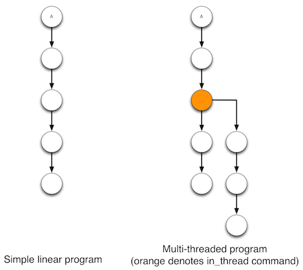

## Lesson 5 - Concurrency

###Introduction

If we want to make some meaningful and interesting musical structures we need to learn some meaningful and interesting programming structures.

### Learning Objectives
- Know that computers can multitask i.e. do many things at once.
- Understand that a simple program has one flow of control i.e. one thread of execution but programs can have multiple threads of execution.
- Be able to program multiple threads work at the same time i.e. concurrently

### Learning Outcomes

**All students will be able to:**

- Know that computers can do multiple things at once.
- Use an `in_thread` block.

**Most students will be able to:**

- Use multiple `in_thread` blocks in the same program.

**Some students will be able to:**

- Understand that threads have a separate flow of control.

###Lesson Summary

-   Overview of the role of the control card and control flow. 
-   Introduction to threads.
-   Using threads to play sounds at the same time.

###Starter
Pupils are first invited to set up and connect their Raspberry Pi hardware. They may then load the Sonic Pi application and find their work from the previous lesson. Through questioning, select students to explain what they did in the previous lesson. 

###Main Development

1. Pupils are asked to form a simple line with the original computation cards and act out the program. Ensure that the control card is correctly handed down the line like a relay baton.
An example program might be:

	```ruby
	beep
  	sleep 1
  	whoosh
  	sleep 0.5
  	ping
  	sleep 2
  	boop
	```
  	
2. Once they have acted this out, invite them to talk about the structure of this code. Lead them into seeing the clear linear structure - they are standing in a line. Also point out that the control card represents control flow. It represents where the computer is in the program. Ask them to discuss the main limitation of only having one control card - only one thing can happen at once. What if we wanted a bass line to play at the same time as a melody?

3. Explain that we’re going to introduce a way of having more than one control card in the same program which will mean more than one thing can happen at the same time. In the programming world, we call this concurrency. The following figure shows how we can move the line of pupils from a single threaded program to a multi-threaded program. The plain circles represent the standard program cards we’ve used so far (whoosh, ping, sleep, etc) and the orange circle represents one of the thread cards. Organise the pupils into such a form - one main line as before, but with a threaded branch. Remind them that this is similar to the conditional branch in the previous less. However, rather than just one of the branches being taken both will be taken! Start the program as normal with the first person (denoted by A in the diagram) having the control card, performing the action, and then passing the control card on to the next person as normal. However, when the control card reaches the person holding the thread card, pass the holder of the thread card another control card and ask them to pass one each to both branches. Now execution happens **concurrently** and independently.

	

4. Now invite the pupils to write the following code:

	```ruby
	in_thread do
  	  10.times do
	    play 60
    	sleep 0.25
  	  end
	end
	play 60 
	sleep 0.5 
	play 62 
	sleep 0.5 
	play 64 
	sleep 0.5 
	play 65 
	sleep 0.5 
	play 67 
	sleep 0.5 
	play 69 
	sleep 0.25 
	play 72
	```
	
6. Explain that this code works exactly like the system they just acted out. The code within the `in_thread` block gets its own control flow and therefore runs at the same time as the `play` & `sleep` code below.

### Plenary

Pupils are invited to play around with the constructs of this lesson in addition to everything they’ve learned so far to design simple a musical program.
